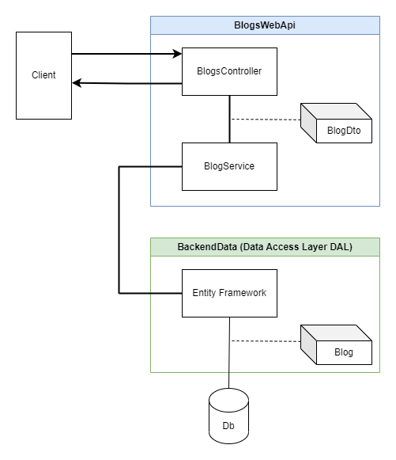

# 3. WithServiceAndDTOs

Projektet er et "eksemplarisk" ASP.NET Core Web API-projekt, som viser best practices når det drejer sig om et mindre Web Api.

Projektet er opdelt i tre lag: Controller, Service og DataAccessLayer.

## BlogService

I folderen `Services` er der oprettet en Blog-service med følgende interfaces:

    public interface IBlogService
    {
        Task<List<BlogDto>> GetAll();
        Task<BlogDto?> GetById(int id);
        Task<BlogDto> CreateAndSave(CreateBlogDto newBlog);
        Task<BlogDto> UpdateAndSave(BlogDto newBlog);
        Task Delete(int id);
        bool BlogExists(int id);
    }

Servicen er implementeret i klassen `BlogService` og er registreret i `Program`-klassen:

	builder.Services.AddScoped<IBlogService, BlogService>();

Alle parametre, som Controlleren sender til Servicen, er DTOs. Dette gør det nemmere at validere forhinder "over-posting".

Alle metoder i Servicen returnerer DTOs, således at Controlleren kan arbejde med DTOs og ikke direkte med databasen.

Alle data, der udveksles mellem Servicen og Entity Framework er Domain Entities.

&nbsp;

## DTOs

Der er oprettet følgende DTOs med records:

    public record BlogDto
    (
        int BlogId,

        [Required]
        [MaxLength(ConfigConstants.DEFAULT_URL_LENGTH)]
        string? Url,

        [Range(ConfigConstants.DEFAULT_RANGE_MIN, ConfigConstants.DEFAULT_RANGE_MAX)]
        int? Rating
    );

    public record CreateBlogDto
    (
        [Required]
        [MaxLength(ConfigConstants.DEFAULT_URL_LENGTH)]
        string? Url,

        [Range(ConfigConstants.DEFAULT_RANGE_MIN, ConfigConstants.DEFAULT_RANGE_MAX)]
        int? Rating
    );

ConfigConstants.cs filen indeholder konstanter, som bruges i DataAnnotation i DTOs.

&nbsp;

## BlogsController
Gennemgå BlogsController og lav demo af metoderne med breakpoint.

Bemærk også de forskellige `ProducesResponseType` attributter og hvordan de påvirker Swagger-dokumentationen.

